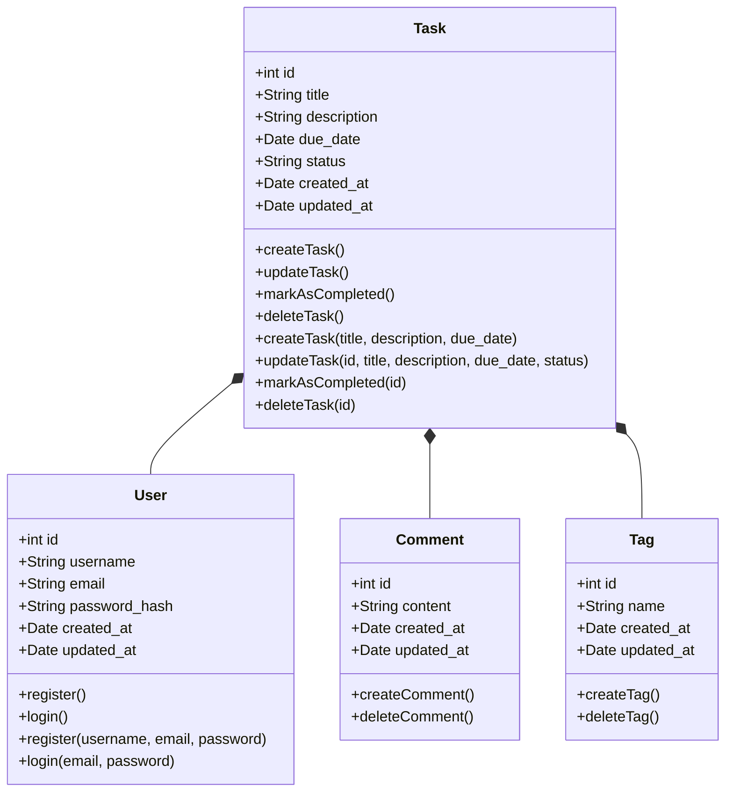

```mermaid
classDiagram
    class Task {
        +int id
        +String title
        +String description
        +Date due_date
        +String status
        +Date created_at
        +Date updated_at
        +createTask()
        +updateTask()
        +markAsCompleted()
        +deleteTask()
    }

    class User {
        +int id
        +String username
        +String email
        +String password_hash
        +Date created_at
        +Date updated_at
        +register()
        +login()
    }

    Task * -- User 
    Task * -- Comment 
    Task * -- Tag 

    class Comment {
        +int id
        +String content
        +Date created_at
        +Date updated_at
        +createComment()
        +deleteComment()
    }

    class Tag {
        +int id
        +String name
        +Date created_at
        +Date updated_at
        +createTag()
        +deleteTag()
    }

    Task : +createTask(title, description, due_date)
    Task : +updateTask(id, title, description, due_date, status)
    Task : +markAsCompleted(id)
    Task : +deleteTask(id)

    User : +register(username, email, password)
    User : +login(email, password)
```
